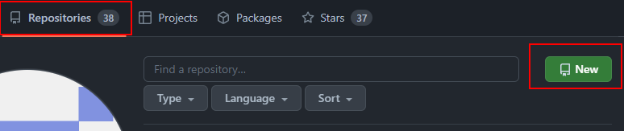

# Using Git with GitHub

---

### Starting from Zero

I find the easiest way to get a GitHub repo / local repo pairing set up is to set up the Github remote repo first.

Navigate to the *repositories* tab once logged into Github, and then click the green *new* button.

### You have already set up a project / virtual environment locally - Creating a Github repo from the command line

