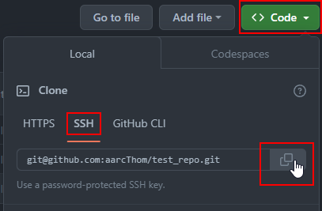

# Using Git with GitHub

---

## Starting from Zero

I find the easiest way to get a GitHub repo / local repo pairing set up is to set up the Github remote repo first. You would do this at the very outset of the project, before you've written a line of code.

---

### Setting up your repo on Github

Navigate to the *repositories* tab once logged into Github, and then click the green *new* button.


In the *Create a new repository* page, give the repo a memorable name. I follow the same naming convention that I use for my Linux directories, namely:

* All lower case
* Use '_' as delimiters

Add a brief description. This description will appear below the *about* section of your repo's page.

Set your repo to public or private.

It's worth adding a README file. This will serve as the 'landing page' of your repo. Including information about what this repo contains is especially important if you plan on sharing with others.

It's also worth adding the basic `.gitignore` template to the repo. You can always edit this file afterwards.

Finally, if you plan on sharing your work, you can add a license. [Choosealicense.com](https://choosealicense.com/) is a good place to start in figuring out what license you should use for your particular case.

Once this is all done, click the *create repository* button.

---

### Cloning your repo to your local computer

Once you have created your repo on Github, navigate to that repo, and click the green *code* button. Select *SSH* and then click the copy button directly to the right of the repo address. This will copy the repo address to your clipboard.



Go to you terminal and `cd` to the directory that will contain the repo. *Note: The cloned repo will be a directory itself. You do not have to make a new directory.* Once you are there use the command `git clone` followed by the address you copied in the last step:

```bash
thomas@ti83:~$ cd repos/ #move to the directory that will hold the repo
thomas@ti83:~/repos$ git clone git@github.com:aarcThom/test_repo.git #clone the repo
Cloning into 'test_repo'...
remote: Enumerating objects: 5, done.
remote: Counting objects: 100% (5/5), done.
remote: Compressing objects: 100% (4/4), done.
remote: Total 5 (delta 0), reused 0 (delta 0), pack-reused 0
Receiving objects: 100% (5/5), 13.96 KiB | 3.49 MiB/s, done.
thomas@ti83:~/repos$
```

If all has gone according to plan, you should see an output similar to above. Assuming that your SSH key is already set up with GitHub, you can now commit and push to the remote Github repo like so:

```bash
thomas@ti83:~/repos$ cd test_repo/ # move to the cloned repo
thomas@ti83:~/repos/test_repo$ touch testfile.txt # creating a test file
thomas@ti83:~/repos/test_repo$ git add . # staging all changes
thomas@ti83:~/repos/test_repo$ git commit -m "Adding a test file" #committing all staged changes
[main b927402] Adding a test file
 1 file changed, 0 insertions(+), 0 deletions(-)
 create mode 100644 testfile.txt
thomas@ti83:~/repos/test_repo$ git push # pushing the changes to the remote GitHub repo
Enumerating objects: 4, done.
Counting objects: 100% (4/4), done.
Delta compression using up to 16 threads
Compressing objects: 100% (2/2), done.
Writing objects: 100% (3/3), 270 bytes | 270.00 KiB/s, done.
Total 3 (delta 1), reused 0 (delta 0), pack-reused 0
remote: Resolving deltas: 100% (1/1), completed with 1 local object.
To github.com:aarcThom/test_repo.git
   11cb475..b927402  main -> main
thomas@ti83:~/repos/test_repo$
```


---


## You have already set up a project / virtual environment locally - Creating a Github repo from the command line

You are going to use Github CLI - to fill in...

