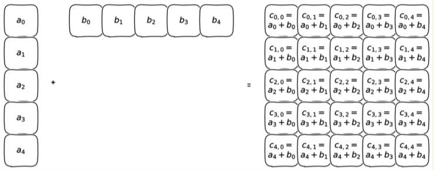

# Broadcasting

---

From the [docs](https://numpy.org/doc/stable/user/basics.broadcasting.html), *The term broadcasting describes how NumPy treats arrays with different shapes during arithmetic operations. Subject to certain constraints, the smaller array is “broadcast” across the larger array so that they have compatible shapes*. 

In linear algebra, tensors need to be of the same shape to perform element-wise arithmetic. For example, this works:
$$
[2,3] + [4,5] = [6,8]
$$
But this does not:
$$
[1,2,3]+
\begin{bmatrix} 
4 \\\ 
5
\end{bmatrix}
= ~?
$$
NumPy relaxes these assumptions and introduces the following 3 rules to match tensor elements.


## Scalar Broadcasting

*For each index dimension, counted from the back, if one of the operands is size 1 in that dimension, PyTorch will use the single entry along this dimension with each of the entries in the other tensor along this dimension.*[^1]

In other words, if we have a NumPy or PyTorch scalar, we will duplicate the scalar by as many elements as there are in the tensor we want to modify and then do the element-wise arithmetic. For example:
$$
[x] + [a,b,c,d] = [a+x,~b+x,~c+x~d+x]
$$
In NumPy:

```python
a = np.array([1])
b = np.array([[1,1,1],[2,2,2]])

print(a+b)

>>> [[2 2 2]
     [3 3 3]]
```

This also works, if tensors contain the same amount of dimensions. In this case, the one to many broadcasting is performed per dimension. For example:

```python
a = np.array([[1],[2]])
b = np.array([[1,1,1],[2,2,2]])

print(a+b)

>>> [[2 2 2]
     [4 4 4]]
```


## Inequal Sizes - Does NOT broadcast

*If both sizes are greater than 1, they must be the same, and natural matching is used.*[^1]

## One Dimension  to Many Dimensions

If one tensor has one dimension, *the entirety of the other tensor will be used for each entry along these dimensions.*[^1]

From *Deep Learning with PyTorch*:



In NumPy:

```python
a = np.array([[1],[2],[3]])
b = np.array([4,5,6])

print(a+b)

>>>[[5 6 7]
    [6 7 8]
    [7 8 9]]
```


---

[^1]: Deep Learning with Pytorch - Eli Stevens, Luca Antiga, Thomas Viehmann


