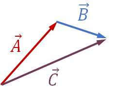

# Vector Operations

---

## Transpose Operation

You can transpose a column vector to a row vector and vice versa. This operation is denoted with a superscript *T*.
$$
[4,2,0]^T = 
\begin{bmatrix} 
4, \\\ 
2,\\\ 
0 
\end{bmatrix}
\\\  
\\\  
\begin{bmatrix} 
3, \\\ 
-2,\\\
13 
\end{bmatrix}^T
= [3, -2, 13]
\\\  
\\\  
$$

---

## Vector Addition and Subtraction

Algebraically, vector addition and subtraction happens element-wise. Vectors need to be the same dimension.

 
$$
[4, 5, 1, 0] + [-4, -3, 3, 10] = [0, 2, 4, 10] \\
\\\  
\begin{bmatrix} 
4, \\\
2,\\\
0
\end{bmatrix}
-
\begin{bmatrix} 
6, \\\
-4,\\\
-60
\end{bmatrix}
+
\begin{bmatrix} 
2, \\\
-5,\\\
40
\end{bmatrix}
=
\begin{bmatrix} 
0, \\\
1,\\\
100
\end{bmatrix}
\\  
\\  
$$
Geometrically, you can add up vectors by *tip to tail* and subtract vectors by multiplying one vector by -1 before adding up *tip to tail*. In the below image, we are adding vector A to vector B.

---

